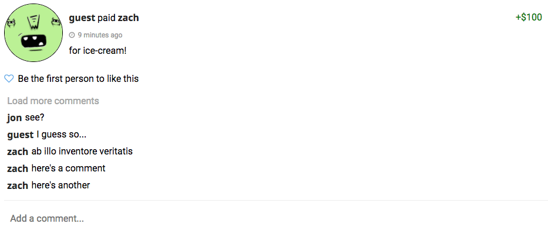

# Zacmo

[Zacmo live][heroku]

[heroku]: http://www.zacmo.herokuapp.com

Zacmo is a social payments web application inspired by Venmo.  It utilizes a React/Redux front-end that communicates with a Ruby on Rails backend, and a PostgreSQL database for storage of user data.

## Features & Implementation

### Friends and Feed

The tables most central to the social aspect of Zacmo are the users, friends, and transactions tables. Creating the schema for the friends table proved to be a bit trickier than I had initially anticipated, given the bi-directional nature of friendships.

## friends
column name | data type | details
------------|-----------|-----------------------
id          | integer   | not null, primary key
user_id     | integer   | not null, foreign key (references users), indexed
friend_id   | integer   | not null, foreign key (references users), indexed
status      | string    | not null, can be ['pending', 'requested', or 'accepted']
created_at  | datetime  | not null
updated_at  | datetime  | not null

This is the model of the friends table, it has two foreign-key columns that each references a row in the users table.

### User Interaction

Aside from the ease with which users can transfer money, the most popular part of Venmo is certainly the social platform it provides. Following suit, I integrated memo's, comments, and likes to each transaction. Leveraging AJAX, comments can be posted and seen immediately by the user. Users can also like - and unlike :( - transactions and the changes will be persisted immediately.

I had some fun with creating animations for the comments. By using JavaScript's setTimeout method and the state of the React component, I created a cool little 'scroll' effect whenever a user clicks to 'show more' comments.

## Future Directions for the Project

In addition to the features already implemented, I plan to continue work on this project.  The next steps for Zacmo are outlined below.

### Real transfers of money by integrating with SynapsePay API

At the time of writing, Zacmo does not allow users to send actual money to friends. The next step of development is to use an API by SynapsePay that will allow users to link bank accounts so that they may send and receive money with to and from their friends.

### Groups

Allow users to create groups to which payments can be sent and distributed amongst members. Venmo does not currently have the functionality and it is something that many people have expressed would be a cool feature.
